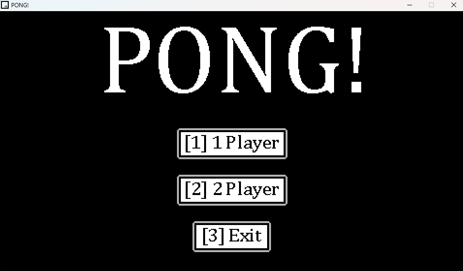
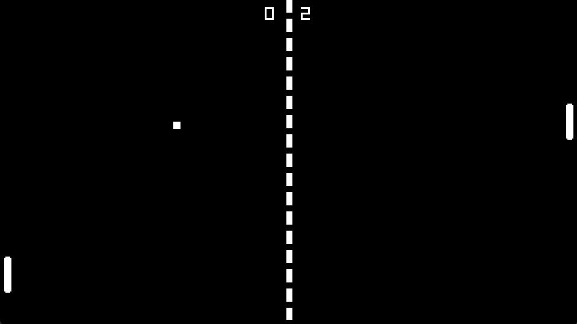

## PONG!

### Description

A classic version of PONG created in C++ with the use of the Raylib Library as a learning experience. 

### Features

 - Single Player
 - Local Two Player

### Controls

Keyboard:
 - Player One - (W = UP, S = DOWN)
 - Player Two - (KEY UP = UP, KEY DOWN = DOWN)
 - Pause Game - (P)

### Screenshots

### Developers

 - Matthew Clements - Sole Developer

### Links
 - Website - https://www.matthew-clements.co.uk/ 
 - itch.io - https://matthewclementsgames.itch.io/pong

### Extras
This game uses the Raylib library which can be found here: https://www.raylib.com/index.html

*Copyright (c) 2024 Matthew Clements Games*
